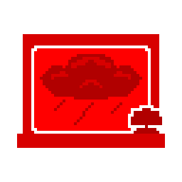

# <span style="color: #cc0000;">WEATHER GORDION</span>


**Language / Язык:** [English](#english) · [Русский](#russian)

<a name="english"></a>
## <span style="color: #cc0000;">WEATHER GORDION</span>

**Author:** <span style="color: #cc0000;">Solo00n</span>

71-Gordion is the one moon the game keeps permanently clear. This mod gives it weather — rain, fog, dust, storms, floods, eclipses and every combined weather your modpack registers — with per-weather weights you control, and an optional day that actually passes so progressing weather can run.

### <span style="color: #cc0000;">WHAT IT DOES</span>

- <strong style="color: #cc0000;">Weather at the Company</strong> — fills Gordion's empty weather pool and takes it out of the blacklist WeatherRegistry ships on every weather by default.
- <strong style="color: #cc0000;">A switch and a weight per weather</strong> — every weather gets its own `[Weather.Name]` section with `Enabled` and `Weight`, so any of them can be turned off on Gordion without touching the rest.
- <strong style="color: #cc0000;">Combined and progressing weathers</strong> — anything registered by WeatherTweaks or Combined Weathers Toolkit gets a section too, `[Weather.Stormy + Rainy]`, `[Weather.Eclipsed > Foggy]`, switched off until you want it.
- <strong style="color: #cc0000;">A day that passes</strong> — Gordion has no day cycle in vanilla, which is why progressing weather cannot progress there. RealTime mode starts the game's own clock for the visit.
- <strong style="color: #cc0000;">A working clock and an end of day</strong> — the HUD clock runs (indoors too, where vanilla hides it), and the ship can fly off at midnight like it does on any other moon. Both are optional.
- <strong style="color: #cc0000;">Nothing else about the moon changes</strong> — `planetHasTime` is deliberately left alone, so selling still costs no deadline day, landing late is never refused, and no end-of-round stats screen appears.
- <strong style="color: #cc0000;">Terminal control</strong> — `weather change` and `weather forecast gordion` come free from WeatherRegistry once the moon has a weather pool.
- <strong style="color: #cc0000;">Leaves your configs alone</strong> — changes are made in memory through WeatherRegistry's API; `mrov.WeatherRegistry.cfg` is never rewritten.

### <span style="color: #cc0000;">HOW IT WORKS</span>

Two separate things keep Gordion clear, and both are handled:

1. **The empty pool.** Weather selection reads the moon's `randomWeathers` array, and Gordion's is empty. Clearing the moon filter does not fill it: WeatherRegistry only *injects* entries for modded weathers, and for a vanilla one it defers to the moon creator — "Vanilla weather not defined by moon creator" — which on Gordion means nothing at all. So the mod writes the pool itself through `WeatherController.AddRandomWeather`, immediately before every weather selection, using the same weather variables WeatherRegistry would have used.
2. **The blacklist.** `Defaults.DefaultLevelFilters` is the literal string `"Company"`, so every weather ships with `Level filter = Company;` under a blacklist — and WeatherRegistry's setup pass actively strips weathers back off the company moon unless the moon is in that weather's apply-list. Correcting the filter is what makes the pool survive a lobby reload.

For time, the obvious lever is the wrong one. `planetHasTime` does not drive the clock — `TimeOfDay.Update` only checks `currentDayTimeStarted`, and the landing sequence reads `planetHasTime` exactly once to decide whether to set it. What `planetHasTime` controls everywhere else is the moon's *identity*: whether leaving burns a deadline day, whether the ship flies off at midnight, whether landing late is refused as "too late on moon", whether the end-of-round stats play, and whether the moon can be drawn for a challenge file. So RealTime mode starts the clock directly and leaves that flag false — Gordion keeps behaving like the Company building in every one of those checks, and every other mod that identifies the Company moon by `!planetHasTime` keeps working.

One thing leaks through and is patched back: `TimeOfDay.MoveGlobalTime` drains `timeUntilDeadline` on every frame regardless of moon. Left alone that would cost you deadline days for selling and shift the company buying rate, so the deadline is held at its pre-landing value for the visit.

Three things go the other way — they sit behind the same `planetHasTime` check and so never happen at the Company, and the mod supplies them itself: `normalizedTimeOfDay` (vanilla only updates it inside `if (sunAnimator != null)`, and progressing weather is driven by it), the HUD clock (vanilla drives it from the same guarded block and hides it whenever you count as indoors), and the midnight departure with its warning (the whole branch lives in `TimeOfDayEvents` behind that flag, so the mod calls the game's own networked `SetShipToLeaveOnMidnightClientRpc`).

Weather variables get the same treatment. `RoundManager.SetToCurrentLevelWeather` copies `weatherVariable`/`weatherVariable2` out of the moon's own pool entry, and the effects read them from there — Flooded computes its water rise as `globalTime / 1080 * weatherVariable2`. Gordion has no authored entries, so the mod borrows the numbers from a moon that does define the weather rather than injecting zeroes, which is what a flood that sits at world height 0 and never rises looks like.

### <span style="color: #cc0000;">MULTIPLAYER (HOST-AUTHORITATIVE)</span>

Nothing here gives a player an edge, and nothing here invents its own netcode. Every decision that affects the round is made once, by the host, and travels on a channel the game or WeatherRegistry already owns.

**Decided by the host, synced by existing code**

- Which weather Gordion gets, and every `weather change`, are WeatherRegistry's own — it syncs them itself.
- Progression stages in Simulated mode are stepped by the host only, and applied through the same call the terminal command uses, so the sync comes for free.
- The end-of-day departure calls the game's own `SetShipToLeaveOnMidnightClientRpc`. Calling `ShipLeaveAutomatically` directly on the host instead would have left everyone else standing on the moon.
- Lightning targets are rebuilt on the host only. `StormyWeather`'s targeting loop already returns early on anyone who is not the owner, so a client rebuilding the list would both waste a scene sweep per player and disagree with the host about what may be struck.

**Computed locally, but from inputs everyone shares**

The clock is started on each machine that has the mod, from the same server-synced `globalTime`. The day offset is set to a flat zero rather than to anything captured at landing — a value derived from the local clock would be taken at whatever moment each machine noticed the ship had landed, and every player would end up on a slightly different time of day. Same inputs, same arithmetic, same time on every screen.

The weather pool is built on every machine, not just the host, and that is deliberate. WeatherRegistry syncs the *choice* of weather but not the numbers behind it: each client runs `RoundManager.SetToCurrentLevelWeather` from its own level generation and copies `weatherVariable`/`weatherVariable2` out of its own pool entry. A client whose Gordion pool was empty would find no entry, keep whatever those fields held before, and get the flood at a different height and the fog at a different density than the host — the same weather, a different world. The pool is therefore rebuilt immediately before that read, on every player, on every landing.

For the same reason the variables are borrowed from a vanilla moon in preference to a modded one. Everyone has the vanilla moon list in the same order, so host and clients settle on the same donor even when their moon mods differ.

**Playing with someone who does not have the mod**

They still get the right weather: it is chosen and synced host-side. They just will not see the Gordion clock, and their game will not draw the weather stages any differently. Nothing about this changes loot, prices, spawns or the quota for anyone — the deadline is explicitly held still while the clock runs, precisely so a selling trip cannot become cheaper or more expensive than it is in vanilla.

### <span style="color: #cc0000;">REQUIREMENTS</span>

- BepInEx 5.4.21+
- WeatherRegistry 0.8.8+ and MrovLib 0.4.15+ (required)
- WeatherTweaks (optional) — needed for combined and progressing weathers
- Combined Weathers Toolkit (optional) — register your own combinations without code

### <span style="color: #cc0000;">INSTALLATION</span>

Install through a mod manager, or drop `WeatherGordion.dll` into `BepInEx/plugins`.

### <span style="color: #cc0000;">CONFIGURATION</span>

`BepInEx/config/Timofey.WeatherGordion.cfg`

| Section | Setting | Default | What it does |
|---|---|---|---|
| 1. General | `Enabled` | `true` | Master switch. |
| 1. General | `DebugMode` | `false` | Logs every unlock, weight write and time transition. |
| 2. Weathers | `Clear weather weight` | `200` | How often Gordion stays clear. 0 guarantees weather every visit. |
| 2. Weathers | `Respect existing config` | `true` | Skip weathers you already gave a Gordion weight by hand. |
| 3. Time | `Gordion time mode` | `RealTime` | `Off`, `RealTime` or `Simulated`. |
| 3. Time | `Freeze deadline on Gordion` | `true` | Hold the quota deadline still while the clock runs. |
| 3. Time | `Ship leaves at end of day` | `true` | RealTime only. Ship departs at midnight, with the usual 90% warning. |
| 3. Time | `Show clock on Gordion` | `true` | Show the HUD clock during the visit, indoors included. |
| 3. Time | `Day length seconds` | `1200` | Simulated only: real seconds per Gordion day. |

**Turning a weather on or off.** Every registered weather gets its own section, named after it:

```ini
[Weather.Rainy]
Enabled = true
Weight = 120

[Weather.Stormy + Rainy]
Enabled = false
Weight = 100
```

`Enabled = false` takes that weather back out of Gordion's pool and changes nothing else — no other moon, no other weather. `Weight` is relative to the other weathers here and to `Clear weather weight`; it is ignored while `Enabled` is false.

Rain, Fog, Stormy, Flooded and Eclipsed start switched on. Everything else — Dust Clouds, and every combination registered by WeatherTweaks or Combined Weathers Toolkit — is bound switched off, so installing a weather pack never quietly changes what happens at the Company. Turn on whichever ones you want.

These sections appear only after the game has loaded far enough for the weather list to exist, the same way WeatherRegistry's own per-weather sections do. Launch once, then edit.

**Time modes.** `RealTime` starts the game clock for the visit and is the mode that makes progressing weather and the rising Flooded water work. `Simulated` never touches the game clock at all — it writes the normalised time itself, draws the HUD clock by hand and steps weather stages on its own timer. Use it if RealTime ever upsets another mod. `Off` keeps Gordion timeless: weather is picked on landing and holds for the visit, which is enough for plain and combined weathers.

### <span style="color: #cc0000;">INTEGRATIONS / COMPATIBILITY</span>

- **WeatherTweaks / Combined Weathers Toolkit** — reached through reflection, never referenced, so the mod loads and works without them.
- **FirstDayGordion, MonstersGordion, RandomDelivery** — unaffected. Because `planetHasTime` stays false, anything identifying the Company moon by that flag, or branching on it, behaves exactly as before.
- **Generic Gordion Overhaul** — asset-only, no conflict; its extra outdoor space makes weather considerably more visible.
- **Other mods that add weather to Gordion** — only weathers this mod added are ever removed, so nothing else's entries are touched.

### <span style="color: #cc0000;">KNOWN LIMITS</span>

- **Eclipsed does not darken the sky.** WeatherRegistry blacklists the Company sun-animator controller (`SunAnimContainerCompanyLevel`) and skips lighting overrides there. The weather is active and everything else about it applies; the sky just stays as it is. This is upstream behaviour, not something this mod can set.
- **Scrap multipliers have no visible effect.** WeatherRegistry's multipliers belong to the weather, not the moon, so they already apply on Gordion — but Gordion has `spawnEnemiesAndScrap = false` and spawns no loot for them to act on. They are not a sell-price modifier. If another mod does spawn scrap there, they apply normally.
- **Flooded rises only in RealTime.** The water level is a function of the game's `globalTime`, which only advances while the real clock runs, so in `Off` and `Simulated` modes it stays where it starts.

### <span style="color: #cc0000;">BUILD</span>

```
dotnet build -c Release
.\build-package.ps1            # Thunderstore zip in dist/
.\build-package.ps1 -Deploy    # ...and drop the DLL into the dev profile
```

### <span style="color: #cc0000;">CREDITS</span>

- **mrov** — WeatherRegistry, WeatherTweaks and MrovLib, which do all the real weather work.
- **Zigzag** — Combined Weathers Toolkit.
- **Zeekerss** — Lethal Company.

---

<a name="russian"></a>
## <span style="color: #cc0000;">WEATHER GORDION</span>

**Автор:** <span style="color: #cc0000;">Solo00n</span>

71-Gordion — единственная луна, на которой игра принципиально держит ясную погоду. Мод даёт ей погоду: дождь, туман, пыль, грозы, потоп, затмение и любые комбинированные погоды, зарегистрированные в вашем модпаке, — с настраиваемыми весами и опциональным ходом времени, чтобы работала прогрессирующая погода.

### <span style="color: #cc0000;">ЧТО ДЕЛАЕТ МОД</span>

- <strong style="color: #cc0000;">Погода на Гордионе</strong> — заполняет пустой пул погод луны и убирает её из чёрного списка, который WeatherRegistry по умолчанию ставит каждой погоде.
- <strong style="color: #cc0000;">Выключатель и вес у каждой погоды</strong> — у каждой своя секция `[Weather.Имя]` с `Enabled` и `Weight`, так что любую можно убрать с Гордиона, не трогая остальные.
- <strong style="color: #cc0000;">Комбинированные и прогрессирующие</strong> — всё от WeatherTweaks и Combined Weathers Toolkit тоже получает свою секцию, `[Weather.Stormy + Rainy]`, `[Weather.Eclipsed > Foggy]`, выключенную до тех пор, пока не понадобится.
- <strong style="color: #cc0000;">Идущее время</strong> — в ваниле на Гордионе нет смены суток, поэтому прогрессирующая погода там не может прогрессировать. Режим RealTime запускает штатные часы игры на время визита.
- <strong style="color: #cc0000;">Рабочие часы и конец дня</strong> — часы в HUD идут (в том числе внутри здания, где ваниль их прячет), а корабль может улетать в полночь, как на любой другой луне. И то и другое отключаемо.
- <strong style="color: #cc0000;">Больше на луне ничего не меняется</strong> — `planetHasTime` сознательно не трогается: продажа не съедает день дедлайна, посадку поздним вечером не запрещают, экран итогов дня не появляется.
- <strong style="color: #cc0000;">Управление из терминала</strong> — `weather change` и `weather forecast gordion` начинают работать сами, как только у луны появляется пул погод.
- <strong style="color: #cc0000;">Ваши конфиги не переписываются</strong> — все изменения делаются в памяти через API WeatherRegistry; `mrov.WeatherRegistry.cfg` остаётся нетронутым.

### <span style="color: #cc0000;">КАК ЭТО РАБОТАЕТ</span>

Ясную погоду на Гордионе держат две независимые вещи, и обе закрыты:

1. **Пустой пул.** Выбор погоды читает массив `randomWeathers` луны, а у Гордиона он пуст. Очистки фильтра для этого мало: WeatherRegistry сам добавляет записи только для модовых погод, а для ванильных полагается на автора луны — «Vanilla weather not defined by moon creator», — что для Гордиона означает «ничего». Поэтому мод пишет пул сам через `WeatherController.AddRandomWeather` прямо перед каждым выбором погоды, с теми же переменными эффекта, которые взял бы WeatherRegistry.
2. **Чёрный список.** `Defaults.DefaultLevelFilters` — это буквально строка `"Company"`, поэтому каждая погода получает `Level filter = Company;` в режиме чёрного списка, а setup-проход WeatherRegistry ещё и вырезает погоды с луны Компании, если её нет в списке применения. Правка фильтра — это то, что позволяет пулу пережить перезаход в лобби.

Со временем очевидный рычаг оказался неправильным. `planetHasTime` не управляет часами: `TimeOfDay.Update` смотрит только на `currentDayTimeStarted`, а последовательность посадки читает `planetHasTime` ровно один раз — чтобы решить, выставлять ли этот флаг. Зато во всех остальных местах `planetHasTime` определяет *идентичность* луны: списывается ли день дедлайна при отлёте, улетает ли корабль в полночь, не запретят ли посадку с формулировкой «too late on moon», играет ли экран итогов дня и может ли луна выпасть в challenge-файле. Поэтому RealTime запускает часы напрямую и оставляет флаг в `false` — Гордион остаётся Гордионом во всех этих проверках, а любой другой мод, опознающий Компанию по `!planetHasTime`, продолжает работать.

Одна вещь всё же протекает и возвращается патчем: `TimeOfDay.MoveGlobalTime` вычитает прошедшее время из `timeUntilDeadline` независимо от луны. Без вмешательства продажа стоила бы вам дней дедлайна и двигала бы курс скупки Компании, поэтому дедлайн удерживается на значении до посадки.

Три вещи, наоборот, приходится доделывать самим — они спрятаны за той же проверкой `planetHasTime` и на Компании не происходят никогда: `normalizedTimeOfDay` (ваниль обновляет его только внутри `if (sunAnimator != null)`, а именно от него зависит прогрессирующая погода), часы в HUD (ваниль рисует их из того же блока и прячет, как только вы считаетесь «внутри») и полуночный отлёт с предупреждением (вся ветка живёт в `TimeOfDayEvents` за этим флагом, поэтому мод вызывает штатный сетевой `SetShipToLeaveOnMidnightClientRpc` игры).

С переменными погоды та же история. `RoundManager.SetToCurrentLevelWeather` копирует `weatherVariable`/`weatherVariable2` из записи пула самой луны, и эффекты читают их оттуда — Flooded считает подъём воды как `globalTime / 1080 * weatherVariable2`. У Гордиона своих записей нет, поэтому мод заимствует числа у луны, где эта погода описана, вместо того чтобы подставлять нули — а нули выглядят ровно как вода на высоте 0, которая никуда не поднимается.

### <span style="color: #cc0000;">МУЛЬТИПЛЕЕР (HOST-AUTHORITATIVE)</span>

Мод не даёт никому преимущества и не изобретает собственный нетворкинг. Всё, что влияет на раунд, решается один раз на хосте и едет по каналу, который уже есть у игры или у WeatherRegistry.

**Решает хост, синхронизирует существующий код**

- Какая погода будет на Гордионе и любые `weather change` — это WeatherRegistry, он синхронизирует их сам.
- Стадии прогрессии в режиме Simulated переключает только хост, применяя их тем же вызовом, что и терминальная команда, — синхронизация достаётся бесплатно.
- Отлёт в конце дня идёт через штатный `SetShipToLeaveOnMidnightClientRpc` игры. Прямой вызов `ShipLeaveAutomatically` на хосте оставил бы всех остальных стоять на луне.
- Список целей для молний пересобирает только хост. Цикл наведения в `StormyWeather` и так выходит на первой же строке у всех, кроме владельца, поэтому клиент тратил бы сканирование сцены впустую и расходился бы с хостом в том, по чему можно бить.

**Считается локально, но из общих для всех данных**

Часы запускаются на каждой машине с модом, но от одного и того же серверного `globalTime`. Смещение дня выставляется в ноль, а не в значение, снятое при посадке: величина, взятая от локальных часов, фиксировалась бы в тот момент, когда конкретная машина заметила посадку, и у каждого игрока было бы своё время суток. Одинаковые входные данные, одинаковая арифметика, одинаковое время на всех экранах.

Пул погод собирается на каждой машине, а не только на хосте, и это сделано намеренно. WeatherRegistry синхронизирует *выбор* погоды, но не числа за ним: каждый клиент вызывает `RoundManager.SetToCurrentLevelWeather` из своей генерации уровня и копирует `weatherVariable`/`weatherVariable2` из своей же записи пула. Клиент с пустым пулом Гордиона не нашёл бы записи, оставил бы в этих полях прежние значения и получил бы воду на другой высоте, а туман — другой плотности, чем у хоста: погода та же, мир разный. Поэтому пул пересобирается прямо перед этим чтением, у каждого игрока, при каждой посадке.

По той же причине переменные заимствуются в первую очередь у ванильной луны, а не у модовой. Ванильный список лун одинаков и в одном порядке у всех, поэтому хост и клиенты выбирают один и тот же источник даже при разном наборе модов на луны.

**Если у кого-то мода нет**

Погоду он всё равно получит правильную — её выбирает и синхронизирует хост. Он просто не увидит часы на Гордионе. Ни на лут, ни на цены, ни на спавн, ни на квоту это не влияет ни для кого: дедлайн намеренно удерживается на месте, пока идут часы, именно чтобы визит за продажей не стал дешевле или дороже, чем в ваниле.

### <span style="color: #cc0000;">ЗАВИСИМОСТИ</span>

- BepInEx 5.4.21+
- WeatherRegistry 0.8.8+ и MrovLib 0.4.15+ (обязательные)
- WeatherTweaks (опционально) — нужен для комбинированных и прогрессирующих погод
- Combined Weathers Toolkit (опционально) — регистрация своих комбинаций без кода

### <span style="color: #cc0000;">УСТАНОВКА</span>

Через менеджер модов либо положить `WeatherGordion.dll` в `BepInEx/plugins`.

### <span style="color: #cc0000;">НАСТРОЙКА</span>

`BepInEx/config/Timofey.WeatherGordion.cfg`

| Секция | Параметр | По умолчанию | Что делает |
|---|---|---|---|
| 1. General | `Enabled` | `true` | Общий выключатель. |
| 1. General | `DebugMode` | `false` | Логирует каждую разблокировку, запись веса и переход времени. |
| 2. Weathers | `Clear weather weight` | `200` | Как часто на Гордионе остаётся ясно. 0 — погода гарантирована каждый визит. |
| 2. Weathers | `Respect existing config` | `true` | Не трогать погоды, которым вы уже задали вес для Гордиона вручную. |
| 3. Time | `Gordion time mode` | `RealTime` | `Off`, `RealTime` или `Simulated`. |
| 3. Time | `Freeze deadline on Gordion` | `true` | Удерживать дедлайн квоты, пока идут часы. |
| 3. Time | `Ship leaves at end of day` | `true` | Только RealTime. Корабль улетает в полночь, с обычным предупреждением на 90% дня. |
| 3. Time | `Show clock on Gordion` | `true` | Показывать часы в HUD во время визита, в том числе в помещении. |
| 3. Time | `Day length seconds` | `1200` | Только Simulated: реальных секунд на сутки Гордиона. |

**Как включить или убрать погоду.** У каждой зарегистрированной погоды своя секция, названная по ней:

```ini
[Weather.Rainy]
Enabled = true
Weight = 120

[Weather.Stormy + Rainy]
Enabled = false
Weight = 100
```

`Enabled = false` убирает эту погоду из пула Гордиона и больше не меняет ничего — ни другие луны, ни другие погоды. `Weight` задаёт вероятность относительно остальных погод здесь же и относительно `Clear weather weight`; при выключенном `Enabled` он не используется.

Дождь, туман, гроза, потоп и затмение включены сразу. Всё остальное — пыльные облака и любые комбинации от WeatherTweaks или Combined Weathers Toolkit — создаётся выключенным, чтобы установка погодного пака не меняла молча происходящее на Компании. Включайте то, что нужно.

Секции появляются только после того, как игра догрузится до момента, когда список погод существует, — ровно как и собственные посекционные настройки WeatherRegistry. Запустите игру один раз, потом правьте.

**Режимы времени.** `RealTime` запускает игровые часы на визит: именно в нём работают прогрессирующая погода и подъём воды у Flooded. `Simulated` вообще не трогает игровые часы — сам пишет нормализованное время, сам рисует часы в HUD и сам переключает стадии по своему таймеру; пригодится, если RealTime когда-нибудь поссорится с другим модом. `Off` оставляет Гордион вне времени: погода выбирается при посадке и держится весь визит — этого достаточно для обычных и комбинированных погод.

### <span style="color: #cc0000;">ИНТЕГРАЦИИ И СОВМЕСТИМОСТЬ</span>

- **WeatherTweaks / Combined Weathers Toolkit** — через рефлексию, без ссылок на сборки: мод грузится и работает и без них.
- **FirstDayGordion, MonstersGordion, RandomDelivery** — не затронуты. Так как `planetHasTime` остаётся `false`, всё, что опознаёт Компанию по этому флагу или ветвится на нём, ведёт себя как раньше.
- **Generic Gordion Overhaul** — только ассеты, конфликта нет; его дополнительное открытое пространство делает погоду заметно виднее.
- **Другие моды, добавляющие погоду на Гордион** — удаляются только погоды, добавленные этим модом, чужие записи не трогаются.

### <span style="color: #cc0000;">ИЗВЕСТНЫЕ ОГРАНИЧЕНИЯ</span>

- **Eclipsed не затемняет небо.** WeatherRegistry держит контроллер солнца Компании (`SunAnimContainerCompanyLevel`) в чёрном списке и пропускает там переопределение освещения. Погода активна, всё остальное применяется — небо просто остаётся прежним. Это поведение самого WeatherRegistry, снаружи оно не настраивается.
- **Множители лута ничего не дают.** Множители WeatherRegistry принадлежат погоде, а не луне, поэтому на Гордионе они уже применяются — но у Гордиона `spawnEnemiesAndScrap = false`, и действовать им не на что. Это не модификатор цены продажи. Если лут на Гордионе спавнит другой мод, множители сработают штатно.
- **Flooded поднимает воду только в RealTime.** Уровень воды — функция игрового `globalTime`, который движется лишь при идущих часах, поэтому в режимах `Off` и `Simulated` он остаётся начальным.

### <span style="color: #cc0000;">СБОРКА</span>

```
dotnet build -c Release
.\build-package.ps1            # zip для Thunderstore в dist/
.\build-package.ps1 -Deploy    # ...и положить DLL в дев-профиль
```

### <span style="color: #cc0000;">БЛАГОДАРНОСТИ</span>

- **mrov** — WeatherRegistry, WeatherTweaks и MrovLib, на которых держится вся погода.
- **Zigzag** — Combined Weathers Toolkit.
- **Zeekerss** — Lethal Company.
